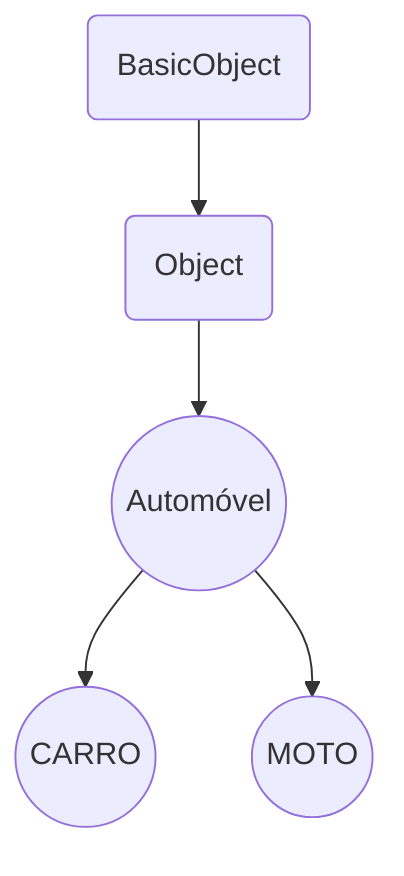

<div align="center">
  

# Jogo de carro 
</div>

``` 
Matéria: Conceitos de Linguagem de Programacao.
Professor(a): Adriana.
Avaliação: 1.
```

## Instalação 

1º. instalar o interpretador da linguagem Ruby:
- Link: [Download](https://www.ruby-lang.org/pt/downloads/)


2º. Com o terminal, instale as dependencias do projeto:

Exemplo     | Comando            | Descrição
:---------: | :------:           |:---------:
Ruby 2D     | `gem install ruby2d` | Cria interface gráfica em 2D.


#Ruby (informações)
```
Ruby é uma linguagem de programação interpretada multiparadigma, 
de tipagem dinâmica e forte, com gerenciamento de memória automático, 
originalmente planejada e desenvolvida no Japão em 1995, 
por Yukihiro "Matz" Matsumoto, para ser usada como linguagem de script.
```

## Herança

> **BasicObject:**: Classe limpa, sem métodos
>
>
> **Object:** é uma clásse herdada de BasicObject, contém diversos metodos e ela está disponível para todas as classes, a menos que seja substituida explicitamente.



## Operadores relacionais.
Símbolo	| Descrição	| Exemplo	| Resultado
| ------ | ------| ------| ------
|`>`	|Maior que	6 > 8	Falso |`6 > 8`|Falso
|`<`	|Menor que	7< 10	Verdadeiro|`7 < 10`|Verdadeiro
|`>=`	|Maior ou igual a	8 >= 8	Verdadeiro|`8 >= 8`|Verdadeiro
|`<=`	|Menor ou igual a	7 <= 2	Falso|`7 <= 2`|Falso
|`!=`	|Diferente de	!= 8	Verdadeiro|`!= 8`|Verdadeiro
|`==`	|Igual a	10 = 10	Verdadeiro|`!= 8`|Verdadeiro
## Operadores lógicos.
Operador |Descrição |	Exemplo |	Resultado
| ------ | ------   | ------  | ------
`and` / `&&` |	E	| `6 > 8 and 7 > 8` |	Falso
`or` / `\|\|`  |	Ou	| `10 < 10 or 15 > 1` |	Verdadeiro
|`not` / `!` |	Não	| `!true` ou `not true`	|Falso 

## Estruturas de decisão.

### if/else/elsif
```ruby
puts "Informe a sua idade"
idade = gets.to_i

if idade >= 0 and idade < 18
  puts "ops! você não tem acesso a esse conteúdo"
elsif idade >= 18
  puts "Olá! seja bem vindo, visitante!"
else
  puts "Essa não é uma idade válida"
end
```
_output:_
```
20
Olá! seja bem vindo, visitante!
```
### Switch / Case
```ruby
  puts "Informe sua idade"
  idade = gets.to_i
  
  case idade
    when 0..12
      puts "você é uma criança"
    when 13..17
      puts "você é um adolescente"
    else
      puts "você é um adulto"
  end
```
_output:_
```
5
você é uma criança
```
## Estruturas de repetição.
### for

exemplo 1:
```ruby
for contador in 0..5 do
    puts "Contagem #{contador}" #interpolação
end
```
_output:_
```
Contagem 0
Contagem 1
Contagem 2
Contagem 3
Contagem 4
Contagem 5
```

exemplo 2 com vetor (array):
```ruby
linguagens = ["ruby", "java", "python", "php", "lua"]

for linguagem in linguagens do
    puts "Valor #{linguagem}"
end
```
_output:_
```
ruby, java, python, php, lua
```

### while
```ruby
  numero = rand(0..5)
  puts "Tente adivinhar o número escolhido pela máquina de 0 a 5"
  numero_chute = gets.to_i

  while numero != numero_chute do
    puts "Ooops! Tente novamente!"
    numero_chute = gets.to_i
  end

  puts "Parabens você acertou! O número é: #{numero}"
```
_output:_
```
5
Parabens você acertou! O número é 5
```

### until
```ruby
until expressão_boleano do
  ...
end
```
### loop
```ruby
loop do
  if condicional
    break
  end
end
```

### Vetores

Array com uma dimensão
```ruby
item = [1, 2, 3, 4]
```

Array de duas dimensões
```ruby
item = [
        [10, 15],
        [4, 5],
        [6, 9],
       ]
```
Tabela Hash

```ruby
car_positions = {
                  x: 10,
                  y: 15
                }
```


<div align="center">

</div>

**Links utilizados no projeto:**

Ruby: <https://www.ruby-lang.org/pt/>

Ruby 2D: <https://www.ruby2d.com/learn/get-started/>
