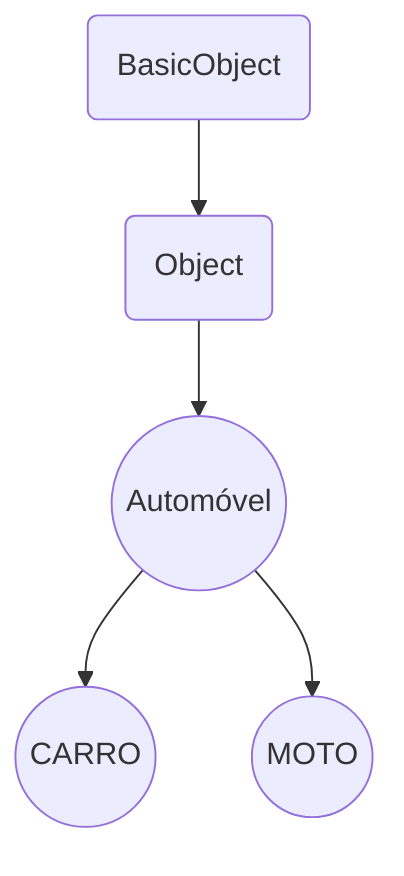

###Jogo Snake (Jogo da cobrinha) 


> **Matéria:** Conceitos de Linguagem de Programacao.
> **Professor(a):** Adriana.
> **Avaliação:** 1.

<div align="center">

</div>

## Instalação 

1º. Após instalar o interpretador da linguagem Ruby:
- Link: [Download](https://www.ruby-lang.org/pt/downloads/)


2º. Com o terminal, instale a dependencia do projeto:

Exemplo     | Comando            | Descrição
:---------: | :------:           |:---------:
Ruby 2D     | `gem install ruby2d` | Cria interface gráfica em 2D.


## Herança

> **BasicObject:**: Classe limpa, sem métodos
>
>
> **Object:** é uma clásse herdada de BasicObject, contém diversos metodos e ela está disponível para todas as classes, a menos que seja substituida explicitamente.




## Switch
```ruby
case objeto
when 1
  puts "Seu número é 1"
when 2..10              # de 2 ao 10
  puts "Seu número está entre 2 e 10"
when 11,13,17,19        # números específicos
  puts "é um número primo entre 10 e 20"
when String             # Uma string ou algo que retorne True.
  puts "é uma String"   
else                    # Qualquer outro valor que não seja os casos de cima
  puts "Qualquer outra coisa."
end
```

